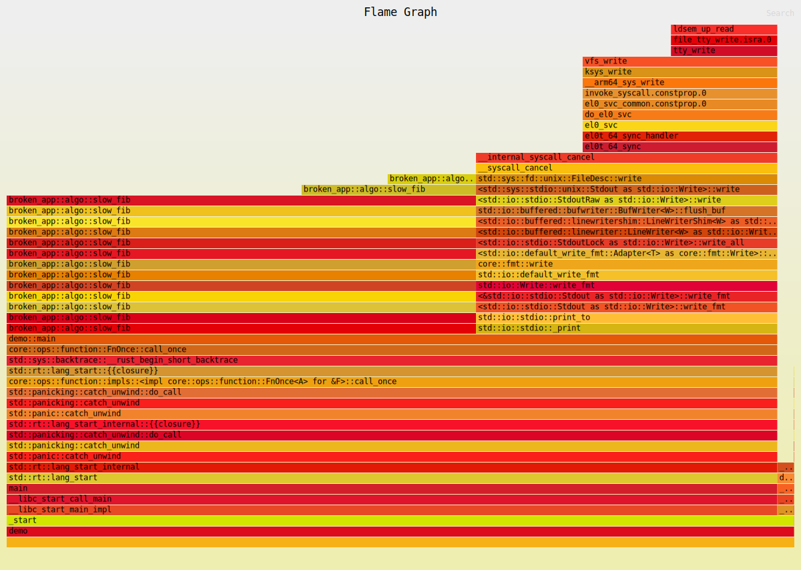
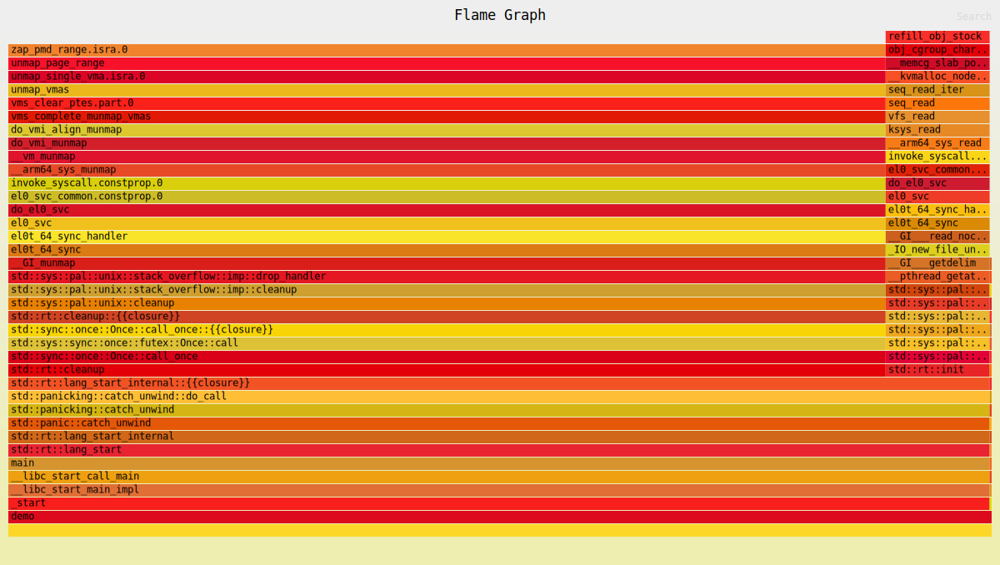

# 1. Ознакомление
broken-app: https://github.com/EugenBA/module5-broken-app.git
reference-app: https://github.com/EugenBA/module5-reference-app.git

## 1.1 Test broken-app:
 - cargo test --all
```text
warning[E0133]: dereference of raw pointer is unsafe and requires unsafe block
  --> src/lib.rs:60:15
   |
60 |     let val = *raw;
   |               ^^^^ dereference of raw pointer
   |
   = note: for more information, see <https://doc.rust-lang.org/edition-guide/rust-2024/unsafe-op-in-unsafe-fn.html>
   = note: raw pointers may be null, dangling or unaligned; they can violate aliasing rules and cause data races: all of these are undefined behavior
note: an unsafe function restricts its caller, but its body is safe by default
  --> src/lib.rs:57:1
   |
57 | pub unsafe fn use_after_free() -> i32 {
   | ^^^^^^^^^^^^^^^^^^^^^^^^^^^^^^^^^^^^^
   = note: `#[warn(unsafe_op_in_unsafe_fn)]` (part of `#[warn(rust_2024_compatibility)]`) on by default

warning[E0133]: call to unsafe function `std::boxed::Box::<T>::from_raw` is unsafe and requires unsafe block
  --> src/lib.rs:61:10
   |
61 |     drop(Box::from_raw(raw));
   |          ^^^^^^^^^^^^^^^^^^ call to unsafe function
   |
   = note: for more information, see <https://doc.rust-lang.org/edition-guide/rust-2024/unsafe-op-in-unsafe-fn.html>
   = note: consult the function's documentation for information on how to avoid undefined behavior

warning[E0133]: dereference of raw pointer is unsafe and requires unsafe block
  --> src/lib.rs:62:11
   |
62 |     val + *raw
   |           ^^^^ dereference of raw pointer
   |
   = note: for more information, see <https://doc.rust-lang.org/edition-guide/rust-2024/unsafe-op-in-unsafe-fn.html>
   = note: raw pointers may be null, dangling or unaligned; they can violate aliasing rules and cause data races: all of these are undefined behavior

For more information about this error, try `rustc --explain E0133`.
warning: `broken-app` (lib) generated 3 warnings (run `cargo fix --lib -p broken-app` to apply 1 suggestion)
warning: `broken-app` (lib test) generated 3 warnings (3 duplicates)
    Finished `test` profile [unoptimized + debuginfo] target(s) in 0.04s
     Running unittests src/lib.rs (target/debug/deps/broken_app-1fcfe3268fbb11df)

running 0 tests

test result: ok. 0 passed; 0 failed; 0 ignored; 0 measured; 0 filtered out; finished in 0.00s

     Running unittests src/bin/demo.rs (target/debug/deps/demo-48b0b01bb0836e32)

running 0 tests

test result: ok. 0 passed; 0 failed; 0 ignored; 0 measured; 0 filtered out; finished in 0.00s

     Running tests/integration.rs (target/debug/deps/integration-f368c4363e590c2a)

running 6 tests
test averages_only_positive ... FAILED
test counts_non_zero_bytes ... ok
test dedup_preserves_uniques ... ok

thread 'sums_even_numbers' (3635230) panicked at src/lib.rs:11:29:
unsafe precondition(s) violated: slice::get_unchecked requires that the index is within the slice

This indicates a bug in the program. This Undefined Behavior check is optional, and cannot be relied on for safety.
thread caused non-unwinding panic. aborting.
```

## 1.2 Test reference-app:
 - cargo test --all
```text
warning: unused import: `std::sync::Arc`
 --> src/concurrency.rs:2:5
  |
2 | use std::sync::Arc;
  |     ^^^^^^^^^^^^^^
  |
  = note: `#[warn(unused_imports)]` (part of `#[warn(unused)]`) on by default

warning: `reference-app` (lib) generated 1 warning (run `cargo fix --lib -p reference-app` to apply 1 suggestion)
warning: `reference-app` (lib test) generated 1 warning (1 duplicate)
    Finished `test` profile [unoptimized + debuginfo] target(s) in 0.05s
     Running unittests src/lib.rs (target/debug/deps/reference_app-e4b02bcd08386c61)

running 0 tests

test result: ok. 0 passed; 0 failed; 0 ignored; 0 measured; 0 filtered out; finished in 0.00s

     Running unittests src/bin/demo.rs (target/debug/deps/demo-1efe159fc66a8cff)

running 0 tests

test result: ok. 0 passed; 0 failed; 0 ignored; 0 measured; 0 filtered out; finished in 0.00s

     Running tests/integration.rs (target/debug/deps/integration-a5c8257c3b039a1f)

running 7 tests
test averages_only_positive ... ok
test counts_non_zero_bytes ... ok
test dedup_preserves_uniques ... ok
test fib_small_numbers ... ok
test normalize_simple ... ok
test sums_even_numbers ... ok
test race_increment_is_correct ... ok

test result: ok. 7 passed; 0 failed; 0 ignored; 0 measured; 0 filtered out; finished in 0.00s

   Doc-tests reference_app

running 0 tests

test result: ok. 0 passed; 0 failed; 0 ignored; 0 measured; 0 filtered out; finished in 0.00s
```
Есть тест который не проходит: <b>test averages_only_positive ... FAILED</b>

# 2. Поиск и исправление багов

## 2.1 GDB
```text
rust-gdb target/debug/deps/integration-d812a20ffb69d6d0
GNU gdb (Ubuntu 15.0.50.20240403-0ubuntu1) 15.0.50.20240403-git
Copyright (C) 2024 Free Software Foundation, Inc.
License GPLv3+: GNU GPL version 3 or later <http://gnu.org/licenses/gpl.html>
This is free software: you are free to change and redistribute it.
There is NO WARRANTY, to the extent permitted by law.
Type "show copying" and "show warranty" for details.
This GDB was configured as "x86_64-linux-gnu".
Type "show configuration" for configuration details.
For bug reporting instructions, please see:
<https://www.gnu.org/software/gdb/bugs/>.
Find the GDB manual and other documentation resources online at:
    <http://www.gnu.org/software/gdb/documentation/>.

For help, type "help".
Type "apropos word" to search for commands related to "word"...
Reading symbols from target/debug/deps/integration-d812a20ffb69d6d0...
(gdb) b broken_app::average_positive
Breakpoint 1 at 0x7a607: file src/lib.rs, line 48.
(gdb) r
Starting program: /mnt/ssd_data/RustProject/module5-eo/broken-app/target/debug/deps/integration-d812a20ffb69d6d0 

This GDB supports auto-downloading debuginfo from the following URLs:
  <https://debuginfod.ubuntu.com>
Enable debuginfod for this session? (y or [n]) y
Debuginfod has been enabled.
To make this setting permanent, add 'set debuginfod enabled on' to .gdbinit.
Downloading separate debug info for system-supplied DSO at 0x7ffff7fc3000
[Thread debugging using libthread_db enabled]                                                                                                                                                                                       
Using host libthread_db library "/lib/x86_64-linux-gnu/libthread_db.so.1".

running 6 tests
[New Thread 0x7ffff7bff6c0 (LWP 3704292)]
[New Thread 0x7fffef7ff6c0 (LWP 3704293)]
[Thread 0x7fffef7ff6c0 (LWP 3704293) exited]
[Switching to Thread 0x7ffff7bff6c0 (LWP 3704292)]

Thread 2 "averages_only_p" hit Breakpoint 1, broken_app::average_positive (values=&[i64](size=3) = {...}) at src/lib.rs:48
48          let sum: i64 = values.iter().sum();
(gdb) p values
$1 = &[i64](size=3) = {-5, 5, 15}
(gdb) D 1
Undefined command: "D".  Try "help".
(gdb) d
Delete all breakpoints, watchpoints, tracepoints, and catchpoints? (y or n) y
(gdb) b src/lib.rs:53
Breakpoint 2 at 0x5555555ce676: file src/lib.rs, line 53.
(gdb) r
The program being debugged has been started already.
Start it from the beginning? (y or n) y
Starting program: /mnt/ssd_data/RustProject/module5-eo/broken-app/target/debug/deps/integration-d812a20ffb69d6d0 
[Thread debugging using libthread_db enabled]
Using host libthread_db library "/lib/x86_64-linux-gnu/libthread_db.so.1".

running 6 tests
[New Thread 0x7ffff7bff6c0 (LWP 3704720)]
[New Thread 0x7ffff79fe6c0 (LWP 3704721)]
[Switching to Thread 0x7ffff7bff6c0 (LWP 3704720)]

Thread 2 "averages_only_p" hit Breakpoint 2, broken_app::average_positive (values=&[i64](size=3) = {...}) at src/lib.rs:53
53      }
(gdb) p sum
No symbol 'sum' in current context
(gdb) d
Delete all breakpoints, watchpoints, tracepoints, and catchpoints? (y or n) y
(gdb) b src/lib.rs:49
Breakpoint 3 at 0x5555555ce62c: file src/lib.rs, line 49.
(gdb) r
The program being debugged has been started already.
Start it from the beginning? (y or n) y
Starting program: /mnt/ssd_data/RustProject/module5-eo/broken-app/target/debug/deps/integration-d812a20ffb69d6d0 
[Thread debugging using libthread_db enabled]
Using host libthread_db library "/lib/x86_64-linux-gnu/libthread_db.so.1".

running 6 tests
[New Thread 0x7ffff7bff6c0 (LWP 3704956)]
[Switching to Thread 0x7ffff7bff6c0 (LWP 3704956)]

Thread 2 "averages_only_p" hit Breakpoint 3, broken_app::average_positive (values=&[i64](size=3) = {...}) at src/lib.rs:49
49          if values.is_empty() {
(gdb) p sum
$2 = 15
(gdb) p values
$3 = &[i64](size=3) = {-5, 5, 15}
(gdb) 
```
## 2.2 MIRI
```text
cargo +nightly miri test
warning[E0133]: dereference of raw pointer is unsafe and requires unsafe block
  --> src/lib.rs:60:15
   |
60 |     let val = *raw;
   |               ^^^^ dereference of raw pointer
   |
   = note: for more information, see <https://doc.rust-lang.org/edition-guide/rust-2024/unsafe-op-in-unsafe-fn.html>
   = note: raw pointers may be null, dangling or unaligned; they can violate aliasing rules and cause data races: all of these are undefined behavior
note: an unsafe function restricts its caller, but its body is safe by default
  --> src/lib.rs:57:1
   |
57 | pub unsafe fn use_after_free() -> i32 {
   | ^^^^^^^^^^^^^^^^^^^^^^^^^^^^^^^^^^^^^
   = note: `#[warn(unsafe_op_in_unsafe_fn)]` (part of `#[warn(rust_2024_compatibility)]`) on by default

warning[E0133]: call to unsafe function `std::boxed::Box::<T>::from_raw` is unsafe and requires unsafe block
  --> src/lib.rs:61:10
   |
61 |     drop(Box::from_raw(raw));
   |          ^^^^^^^^^^^^^^^^^^ call to unsafe function
   |
   = note: for more information, see <https://doc.rust-lang.org/edition-guide/rust-2024/unsafe-op-in-unsafe-fn.html>
   = note: consult the function's documentation for information on how to avoid undefined behavior

warning[E0133]: dereference of raw pointer is unsafe and requires unsafe block
  --> src/lib.rs:62:11
   |
62 |     val + *raw
   |           ^^^^ dereference of raw pointer
   |
   = note: for more information, see <https://doc.rust-lang.org/edition-guide/rust-2024/unsafe-op-in-unsafe-fn.html>
   = note: raw pointers may be null, dangling or unaligned; they can violate aliasing rules and cause data races: all of these are undefined behavior

For more information about this error, try `rustc --explain E0133`.
warning: `broken-app` (lib) generated 3 warnings (run `cargo fix --lib -p broken-app` to apply 1 suggestion)
    Finished `test` profile [unoptimized + debuginfo] target(s) in 0.02s
     Running unittests src/lib.rs (target/miri/x86_64-unknown-linux-gnu/debug/deps/broken_app-8710f211e5fc635a)
warning[E0133]: dereference of raw pointer is unsafe and requires unsafe block
  --> src/lib.rs:60:15
   |
60 |     let val = *raw;
   |               ^^^^ dereference of raw pointer
   |
   = note: for more information, see <https://doc.rust-lang.org/edition-guide/rust-2024/unsafe-op-in-unsafe-fn.html>
   = note: raw pointers may be null, dangling or unaligned; they can violate aliasing rules and cause data races: all of these are undefined behavior
note: an unsafe function restricts its caller, but its body is safe by default
  --> src/lib.rs:57:1
   |
57 | pub unsafe fn use_after_free() -> i32 {
   | ^^^^^^^^^^^^^^^^^^^^^^^^^^^^^^^^^^^^^
   = note: `#[warn(unsafe_op_in_unsafe_fn)]` (part of `#[warn(rust_2024_compatibility)]`) on by default

warning[E0133]: call to unsafe function `std::boxed::Box::<T>::from_raw` is unsafe and requires unsafe block
  --> src/lib.rs:61:10
   |
61 |     drop(Box::from_raw(raw));
   |          ^^^^^^^^^^^^^^^^^^ call to unsafe function
   |
   = note: for more information, see <https://doc.rust-lang.org/edition-guide/rust-2024/unsafe-op-in-unsafe-fn.html>
   = note: consult the function's documentation for information on how to avoid undefined behavior

warning[E0133]: dereference of raw pointer is unsafe and requires unsafe block
  --> src/lib.rs:62:11
   |
62 |     val + *raw
   |           ^^^^ dereference of raw pointer
   |
   = note: for more information, see <https://doc.rust-lang.org/edition-guide/rust-2024/unsafe-op-in-unsafe-fn.html>
   = note: raw pointers may be null, dangling or unaligned; they can violate aliasing rules and cause data races: all of these are undefined behavior


running 0 tests

test result: ok. 0 passed; 0 failed; 0 ignored; 0 measured; 0 filtered out; finished in 0.03s

     Running unittests src/bin/demo.rs (target/miri/x86_64-unknown-linux-gnu/debug/deps/demo-877f2d04eadb8ffe)

running 0 tests

test result: ok. 0 passed; 0 failed; 0 ignored; 0 measured; 0 filtered out; finished in 0.03s

     Running tests/integration.rs (target/miri/x86_64-unknown-linux-gnu/debug/deps/integration-2e7be9085bf6b1f8)

running 6 tests
test averages_only_positive ... FAILED
test counts_non_zero_bytes ... ok
test dedup_preserves_uniques ... ok
test fib_small_numbers ... ok
test normalize_simple ... ok
test sums_even_numbers ... error: Undefined Behavior: `assume` called with `false`
  --> src/lib.rs:11:22
   |
11 |             let v = *values.get_unchecked(idx);
   |                      ^^^^^^^^^^^^^^^^^^^^^^^^^ Undefined Behavior occurred here
   |
   = help: this indicates a bug in the program: it performed an invalid operation, and caused Undefined Behavior
   = help: see https://doc.rust-lang.org/nightly/reference/behavior-considered-undefined.html for further information
   = note: this is on thread `sums_even_numbe`
   = note: stack backtrace:
           0: broken_app::sum_even
               at src/lib.rs:11:22: 11:47
           1: sums_even_numbers
               at tests/integration.rs:7:16: 7:31
           2: sums_even_numbers::{closure#0}
               at tests/integration.rs:4:23: 4:23

note: some details are omitted, run with `MIRIFLAGS=-Zmiri-backtrace=full` for a verbose backtrace

```
## 2.3 Valgrind
```text
valgrind --leak-check=full cargo test --tests
==3642402== Memcheck, a memory error detector
==3642402== Copyright (C) 2002-2022, and GNU GPL'd, by Julian Seward et al.
==3642402== Using Valgrind-3.22.0 and LibVEX; rerun with -h for copyright info
==3642402== Command: cargo test --tests
==3642402== 
warning[E0133]: dereference of raw pointer is unsafe and requires unsafe block
  --> src/lib.rs:60:15
   |
60 |     let val = *raw;
   |               ^^^^ dereference of raw pointer
   |
   = note: for more information, see <https://doc.rust-lang.org/edition-guide/rust-2024/unsafe-op-in-unsafe-fn.html>
   = note: raw pointers may be null, dangling or unaligned; they can violate aliasing rules and cause data races: all of these are undefined behavior
note: an unsafe function restricts its caller, but its body is safe by default
  --> src/lib.rs:57:1
   |
57 | pub unsafe fn use_after_free() -> i32 {
   | ^^^^^^^^^^^^^^^^^^^^^^^^^^^^^^^^^^^^^
   = note: `#[warn(unsafe_op_in_unsafe_fn)]` (part of `#[warn(rust_2024_compatibility)]`) on by default

warning[E0133]: call to unsafe function `std::boxed::Box::<T>::from_raw` is unsafe and requires unsafe block
  --> src/lib.rs:61:10
   |
61 |     drop(Box::from_raw(raw));
   |          ^^^^^^^^^^^^^^^^^^ call to unsafe function
   |
   = note: for more information, see <https://doc.rust-lang.org/edition-guide/rust-2024/unsafe-op-in-unsafe-fn.html>
   = note: consult the function's documentation for information on how to avoid undefined behavior

warning[E0133]: dereference of raw pointer is unsafe and requires unsafe block
  --> src/lib.rs:62:11
   |
62 |     val + *raw
   |           ^^^^ dereference of raw pointer
   |
   = note: for more information, see <https://doc.rust-lang.org/edition-guide/rust-2024/unsafe-op-in-unsafe-fn.html>
   = note: raw pointers may be null, dangling or unaligned; they can violate aliasing rules and cause data races: all of these are undefined behavior

For more information about this error, try `rustc --explain E0133`.
warning: `broken-app` (lib) generated 3 warnings (run `cargo fix --lib -p broken-app` to apply 1 suggestion)
warning: `broken-app` (lib test) generated 3 warnings (3 duplicates)
    Finished `test` profile [unoptimized + debuginfo] target(s) in 0.02s
     Running unittests src/lib.rs (target/debug/deps/broken_app-1fcfe3268fbb11df)

running 0 tests

test result: ok. 0 passed; 0 failed; 0 ignored; 0 measured; 0 filtered out; finished in 0.00s

     Running unittests src/bin/demo.rs (target/debug/deps/demo-48b0b01bb0836e32)

running 0 tests

test result: ok. 0 passed; 0 failed; 0 ignored; 0 measured; 0 filtered out; finished in 0.00s

     Running tests/integration.rs (target/debug/deps/integration-f368c4363e590c2a)

running 6 tests
test dedup_preserves_uniques ... ok
test fib_small_numbers ... ok
test normalize_simple ... ok
test counts_non_zero_bytes ... ok
test averages_only_positive ... FAILED
thread 'sums_even_numbers' (3642452) panicked at src/lib.rs:11:29:
unsafe precondition(s) violated: slice::get_unchecked requires that the index is within the slice

This indicates a bug in the program. This Undefined Behavior check is optional, and cannot be relied on for safety.
thread caused non-unwinding panic. aborting.
```

## 2.4 Sanitizers
```text
RUSTFLAGS="-Zsanitizer=address" cargo test --target x86_64-unknown-linux-gnu
warning[E0133]: dereference of raw pointer is unsafe and requires unsafe block
  --> src/lib.rs:60:15
   |
60 |     let val = *raw;
   |               ^^^^ dereference of raw pointer
   |
   = note: for more information, see <https://doc.rust-lang.org/edition-guide/rust-2024/unsafe-op-in-unsafe-fn.html>
   = note: raw pointers may be null, dangling or unaligned; they can violate aliasing rules and cause data races: all of these are undefined behavior
note: an unsafe function restricts its caller, but its body is safe by default
  --> src/lib.rs:57:1
   |
57 | pub unsafe fn use_after_free() -> i32 {
   | ^^^^^^^^^^^^^^^^^^^^^^^^^^^^^^^^^^^^^
   = note: `#[warn(unsafe_op_in_unsafe_fn)]` (part of `#[warn(rust_2024_compatibility)]`) on by default

warning[E0133]: call to unsafe function `std::boxed::Box::<T>::from_raw` is unsafe and requires unsafe block
  --> src/lib.rs:61:10
   |
61 |     drop(Box::from_raw(raw));
   |          ^^^^^^^^^^^^^^^^^^ call to unsafe function
   |
   = note: for more information, see <https://doc.rust-lang.org/edition-guide/rust-2024/unsafe-op-in-unsafe-fn.html>
   = note: consult the function's documentation for information on how to avoid undefined behavior

warning[E0133]: dereference of raw pointer is unsafe and requires unsafe block
  --> src/lib.rs:62:11
   |
62 |     val + *raw
   |           ^^^^ dereference of raw pointer
   |
   = note: for more information, see <https://doc.rust-lang.org/edition-guide/rust-2024/unsafe-op-in-unsafe-fn.html>
   = note: raw pointers may be null, dangling or unaligned; they can violate aliasing rules and cause data races: all of these are undefined behavior

For more information about this error, try `rustc --explain E0133`.
warning: `broken-app` (lib) generated 3 warnings (run `cargo fix --lib -p broken-app` to apply 1 suggestion)
warning: `broken-app` (lib test) generated 3 warnings (3 duplicates)
    Finished `test` profile [unoptimized + debuginfo] target(s) in 0.04s
     Running unittests src/lib.rs (target/x86_64-unknown-linux-gnu/debug/deps/broken_app-823f9bd8cd006800)

running 0 tests

test result: ok. 0 passed; 0 failed; 0 ignored; 0 measured; 0 filtered out; finished in 0.00s

     Running unittests src/bin/demo.rs (target/x86_64-unknown-linux-gnu/debug/deps/demo-41f520e4cd023b42)

running 0 tests

test result: ok. 0 passed; 0 failed; 0 ignored; 0 measured; 0 filtered out; finished in 0.00s

     Running tests/integration.rs (target/x86_64-unknown-linux-gnu/debug/deps/integration-6383544173c3801d)

running 6 tests

thread 'sums_even_numbers' (3654154) panicked at src/lib.rs:11:29:
unsafe precondition(s) violated: slice::get_unchecked requires that the index is within the slice

This indicates a bug in the program. This Undefined Behavior check is optional, and cannot be relied on for safety.
thread caused non-unwinding panic. aborting.
```

```text
RUSTFLAGS="-Zsanitizer=thread -Cunsafe-allow-abi-mismatch=sanitizer" cargo test --target x86_64-unknown-linux-gnu
   Compiling cfg-if v1.0.4
   Compiling either v1.15.0
   Compiling itoa v1.0.15
   Compiling ryu v1.0.20
   Compiling regex-syntax v0.8.8
   Compiling plotters-backend v0.3.7
   Compiling memchr v2.7.6
   Compiling clap_lex v0.7.6
   Compiling anstyle v1.0.13
   Compiling crossbeam-utils v0.8.21
   Compiling serde_core v1.0.228
   Compiling zerocopy v0.8.31
   Compiling serde v1.0.228
   Compiling rayon-core v1.13.0
   Compiling serde_json v1.0.145
   Compiling libc v0.2.178
   Compiling ciborium-io v0.2.2
   Compiling num-traits v0.2.19
   Compiling cast v0.3.0
   Compiling same-file v1.0.6
   Compiling once_cell v1.21.3
   Compiling oorandom v11.1.5
   Compiling anes v0.1.6
   Compiling broken-app v0.1.0 (/mnt/ssd_data/RustProject/module5-eo/broken-app)
   Compiling walkdir v2.5.0
   Compiling clap_builder v4.5.53
   Compiling itertools v0.10.5
   Compiling plotters-svg v0.3.7
   Compiling crossbeam-epoch v0.9.18
   Compiling crossbeam-deque v0.8.6
   Compiling is-terminal v0.4.17
   Compiling plotters v0.3.7
   Compiling rayon v1.11.0
   Compiling regex-automata v0.4.13
   Compiling criterion-plot v0.5.0
   Compiling clap v4.5.53
   Compiling half v2.7.1
   Compiling ciborium-ll v0.2.2
   Compiling ciborium v0.2.2
   Compiling regex v1.12.2
   Compiling tinytemplate v1.2.1
   Compiling criterion v0.5.1
    Finished `test` profile [unoptimized + debuginfo] target(s) in 3.65s
     Running unittests src/lib.rs (target/x86_64-unknown-linux-gnu/debug/deps/broken_app-49c98b71c18b8b86)

running 0 tests

test result: ok. 0 passed; 0 failed; 0 ignored; 0 measured; 0 filtered out; finished in 0.00s

     Running unittests src/bin/demo.rs (target/x86_64-unknown-linux-gnu/debug/deps/demo-9fe2e76aae50f5e7)

running 0 tests

test result: ok. 0 passed; 0 failed; 0 ignored; 0 measured; 0 filtered out; finished in 0.00s

     Running tests/integration.rs (target/x86_64-unknown-linux-gnu/debug/deps/integration-342bf5a5d6a7434e)

running 8 tests
==================
WARNING: ThreadSanitizer: data race (pid=16223)
  Write of size 8 at 0x729400000148 by thread T2:                                                                                                                                                                                   
    #0 memcpy /rustc/llvm/src/llvm-project/compiler-rt/lib/tsan/rtl/../../sanitizer_common/sanitizer_common_interceptors_memintrinsics.inc:117 (integration-342bf5a5d6a7434e+0x6f45e) (BuildId: b6b8d58f4017b0e81694f9e75e233ea8dc484e75)
    #1 core::profiling::compiler_copy::<core::mem::maybe_uninit::MaybeUninit<test::event::CompletedTest>, 304> /rustc/efc9e1b50cbf2cede7ebe25f0a1fc64fd8b3e942/library/core/src/profiling.rs:29 (integration-342bf5a5d6a7434e+0x117126) (BuildId: b6b8d58f4017b0e81694f9e75e233ea8dc484e75)
    #2 core::ptr::write::<core::mem::maybe_uninit::MaybeUninit<test::event::CompletedTest>> /rustc/efc9e1b50cbf2cede7ebe25f0a1fc64fd8b3e942/library/core/src/ptr/mod.rs:1910 (integration-342bf5a5d6a7434e+0x117126)
    #3 <*mut core::mem::maybe_uninit::MaybeUninit<test::event::CompletedTest>>::write /rustc/efc9e1b50cbf2cede7ebe25f0a1fc64fd8b3e942/library/core/src/ptr/mut_ptr.rs:1418 (integration-342bf5a5d6a7434e+0x117126)
    #4 <std::sync::mpmc::list::Channel<test::event::CompletedTest>>::write /rustc/efc9e1b50cbf2cede7ebe25f0a1fc64fd8b3e942/library/std/src/sync/mpmc/list.rs:274 (integration-342bf5a5d6a7434e+0x117126)
    #5 <std::sync::mpmc::list::Channel<test::event::CompletedTest>>::send /rustc/efc9e1b50cbf2cede7ebe25f0a1fc64fd8b3e942/library/std/src/sync/mpmc/list.rs:411 (integration-342bf5a5d6a7434e+0x117126)
    #6 <std::sync::mpmc::Sender<test::event::CompletedTest>>::send /rustc/efc9e1b50cbf2cede7ebe25f0a1fc64fd8b3e942/library/std/src/sync/mpmc/mod.rs:396 (integration-342bf5a5d6a7434e+0x117126)

  Previous write of size 8 at 0x729400000148 by thread T1:
    #0 calloc /rustc/llvm/src/llvm-project/compiler-rt/lib/tsan/rtl/tsan_interceptors_posix.cpp:692 (integration-342bf5a5d6a7434e+0x723f7) (BuildId: b6b8d58f4017b0e81694f9e75e233ea8dc484e75)                                      
    #1 alloc::alloc::alloc_zeroed /rustc/efc9e1b50cbf2cede7ebe25f0a1fc64fd8b3e942/library/alloc/src/alloc.rs:178 (integration-342bf5a5d6a7434e+0x116ff0) (BuildId: b6b8d58f4017b0e81694f9e75e233ea8dc484e75)
    #2 <alloc::alloc::Global>::alloc_impl_runtime /rustc/efc9e1b50cbf2cede7ebe25f0a1fc64fd8b3e942/library/alloc/src/alloc.rs:190 (integration-342bf5a5d6a7434e+0x116ff0)
    #3 <alloc::alloc::Global>::alloc_impl /rustc/efc9e1b50cbf2cede7ebe25f0a1fc64fd8b3e942/library/alloc/src/alloc.rs:312 (integration-342bf5a5d6a7434e+0x116ff0)
    #4 <alloc::alloc::Global as core::alloc::Allocator>::allocate_zeroed /rustc/efc9e1b50cbf2cede7ebe25f0a1fc64fd8b3e942/library/alloc/src/alloc.rs:435 (integration-342bf5a5d6a7434e+0x116ff0)
    #5 <alloc::boxed::Box<std::sync::mpmc::list::Block<test::event::CompletedTest>>>::try_new_zeroed_in /rustc/efc9e1b50cbf2cede7ebe25f0a1fc64fd8b3e942/library/alloc/src/boxed.rs:654 (integration-342bf5a5d6a7434e+0x116ff0)
    #6 <alloc::boxed::Box<std::sync::mpmc::list::Block<test::event::CompletedTest>>>::new_zeroed_in /rustc/efc9e1b50cbf2cede7ebe25f0a1fc64fd8b3e942/library/alloc/src/boxed.rs:617 (integration-342bf5a5d6a7434e+0x116ff0)
    #7 <alloc::boxed::Box<std::sync::mpmc::list::Block<test::event::CompletedTest>>>::new_zeroed /rustc/efc9e1b50cbf2cede7ebe25f0a1fc64fd8b3e942/library/alloc/src/boxed.rs:309 (integration-342bf5a5d6a7434e+0x116ff0)
    #8 <std::sync::mpmc::list::Block<test::event::CompletedTest>>::new /rustc/efc9e1b50cbf2cede7ebe25f0a1fc64fd8b3e942/library/std/src/sync/mpmc/list.rs:73 (integration-342bf5a5d6a7434e+0x116ff0)
    #9 <std::sync::mpmc::list::Channel<test::event::CompletedTest>>::start_send /rustc/efc9e1b50cbf2cede7ebe25f0a1fc64fd8b3e942/library/std/src/sync/mpmc/list.rs:208 (integration-342bf5a5d6a7434e+0x116ff0)
    #10 <std::sync::mpmc::list::Channel<test::event::CompletedTest>>::send /rustc/efc9e1b50cbf2cede7ebe25f0a1fc64fd8b3e942/library/std/src/sync/mpmc/list.rs:410 (integration-342bf5a5d6a7434e+0x116ff0)
    #11 <std::sync::mpmc::Sender<test::event::CompletedTest>>::send /rustc/efc9e1b50cbf2cede7ebe25f0a1fc64fd8b3e942/library/std/src/sync/mpmc/mod.rs:396 (integration-342bf5a5d6a7434e+0x116ff0)

  Location is heap block of size 9680 at 0x729400000000 allocated by thread T1:
    #0 calloc /rustc/llvm/src/llvm-project/compiler-rt/lib/tsan/rtl/tsan_interceptors_posix.cpp:692 (integration-342bf5a5d6a7434e+0x723f7) (BuildId: b6b8d58f4017b0e81694f9e75e233ea8dc484e75)                                      
    #1 alloc::alloc::alloc_zeroed /rustc/efc9e1b50cbf2cede7ebe25f0a1fc64fd8b3e942/library/alloc/src/alloc.rs:178 (integration-342bf5a5d6a7434e+0x116ff0) (BuildId: b6b8d58f4017b0e81694f9e75e233ea8dc484e75)
    #2 <alloc::alloc::Global>::alloc_impl_runtime /rustc/efc9e1b50cbf2cede7ebe25f0a1fc64fd8b3e942/library/alloc/src/alloc.rs:190 (integration-342bf5a5d6a7434e+0x116ff0)
    #3 <alloc::alloc::Global>::alloc_impl /rustc/efc9e1b50cbf2cede7ebe25f0a1fc64fd8b3e942/library/alloc/src/alloc.rs:312 (integration-342bf5a5d6a7434e+0x116ff0)
    #4 <alloc::alloc::Global as core::alloc::Allocator>::allocate_zeroed /rustc/efc9e1b50cbf2cede7ebe25f0a1fc64fd8b3e942/library/alloc/src/alloc.rs:435 (integration-342bf5a5d6a7434e+0x116ff0)
    #5 <alloc::boxed::Box<std::sync::mpmc::list::Block<test::event::CompletedTest>>>::try_new_zeroed_in /rustc/efc9e1b50cbf2cede7ebe25f0a1fc64fd8b3e942/library/alloc/src/boxed.rs:654 (integration-342bf5a5d6a7434e+0x116ff0)
    #6 <alloc::boxed::Box<std::sync::mpmc::list::Block<test::event::CompletedTest>>>::new_zeroed_in /rustc/efc9e1b50cbf2cede7ebe25f0a1fc64fd8b3e942/library/alloc/src/boxed.rs:617 (integration-342bf5a5d6a7434e+0x116ff0)
    #7 <alloc::boxed::Box<std::sync::mpmc::list::Block<test::event::CompletedTest>>>::new_zeroed /rustc/efc9e1b50cbf2cede7ebe25f0a1fc64fd8b3e942/library/alloc/src/boxed.rs:309 (integration-342bf5a5d6a7434e+0x116ff0)
    #8 <std::sync::mpmc::list::Block<test::event::CompletedTest>>::new /rustc/efc9e1b50cbf2cede7ebe25f0a1fc64fd8b3e942/library/std/src/sync/mpmc/list.rs:73 (integration-342bf5a5d6a7434e+0x116ff0)
    #9 <std::sync::mpmc::list::Channel<test::event::CompletedTest>>::start_send /rustc/efc9e1b50cbf2cede7ebe25f0a1fc64fd8b3e942/library/std/src/sync/mpmc/list.rs:208 (integration-342bf5a5d6a7434e+0x116ff0)
    #10 <std::sync::mpmc::list::Channel<test::event::CompletedTest>>::send /rustc/efc9e1b50cbf2cede7ebe25f0a1fc64fd8b3e942/library/std/src/sync/mpmc/list.rs:410 (integration-342bf5a5d6a7434e+0x116ff0)
    #11 <std::sync::mpmc::Sender<test::event::CompletedTest>>::send /rustc/efc9e1b50cbf2cede7ebe25f0a1fc64fd8b3e942/library/std/src/sync/mpmc/mod.rs:396 (integration-342bf5a5d6a7434e+0x116ff0)

  Thread T2 'counts_non_zero' (tid=16228, running) created by main thread at:
    #0 pthread_create /rustc/llvm/src/llvm-project/compiler-rt/lib/tsan/rtl/tsan_interceptors_posix.cpp:1078 (integration-342bf5a5d6a7434e+0x73f5a) (BuildId: b6b8d58f4017b0e81694f9e75e233ea8dc484e75)                             
    #1 <std::sys::thread::unix::Thread>::new /rustc/efc9e1b50cbf2cede7ebe25f0a1fc64fd8b3e942/library/std/src/sys/thread/unix.rs:98 (integration-342bf5a5d6a7434e+0x166c60) (BuildId: b6b8d58f4017b0e81694f9e75e233ea8dc484e75)
    #2 <fn() as core::ops::function::FnOnce<()>>::call_once /home/eugen/.rustup/toolchains/nightly-x86_64-unknown-linux-gnu/lib/rustlib/src/rust/library/core/src/ops/function.rs:250 (integration-342bf5a5d6a7434e+0xfb96e) (BuildId: b6b8d58f4017b0e81694f9e75e233ea8dc484e75)
    #3 std::sys::backtrace::__rust_begin_short_backtrace::<fn(), ()> /home/eugen/.rustup/toolchains/nightly-x86_64-unknown-linux-gnu/lib/rustlib/src/rust/library/std/src/sys/backtrace.rs:166 (integration-342bf5a5d6a7434e+0xfe6c1) (BuildId: b6b8d58f4017b0e81694f9e75e233ea8dc484e75)
    #4 std::rt::lang_start::<()>::{closure#0} /home/eugen/.rustup/toolchains/nightly-x86_64-unknown-linux-gnu/lib/rustlib/src/rust/library/std/src/rt.rs:206 (integration-342bf5a5d6a7434e+0xfd11e) (BuildId: b6b8d58f4017b0e81694f9e75e233ea8dc484e75)
    #5 <&dyn core::ops::function::Fn<(), Output = i32> + core::marker::Sync + core::panic::unwind_safe::RefUnwindSafe as core::ops::function::FnOnce<()>>::call_once /rustc/efc9e1b50cbf2cede7ebe25f0a1fc64fd8b3e942/library/core/src/ops/function.rs:287 (integration-342bf5a5d6a7434e+0x179cc5) (BuildId: b6b8d58f4017b0e81694f9e75e233ea8dc484e75)
    #6 std::panicking::catch_unwind::do_call::<&dyn core::ops::function::Fn<(), Output = i32> + core::marker::Sync + core::panic::unwind_safe::RefUnwindSafe, i32> /rustc/efc9e1b50cbf2cede7ebe25f0a1fc64fd8b3e942/library/std/src/panicking.rs:581 (integration-342bf5a5d6a7434e+0x179cc5)
    #7 std::panicking::catch_unwind::<i32, &dyn core::ops::function::Fn<(), Output = i32> + core::marker::Sync + core::panic::unwind_safe::RefUnwindSafe> /rustc/efc9e1b50cbf2cede7ebe25f0a1fc64fd8b3e942/library/std/src/panicking.rs:544 (integration-342bf5a5d6a7434e+0x179cc5)
    #8 std::panic::catch_unwind::<&dyn core::ops::function::Fn<(), Output = i32> + core::marker::Sync + core::panic::unwind_safe::RefUnwindSafe, i32> /rustc/efc9e1b50cbf2cede7ebe25f0a1fc64fd8b3e942/library/std/src/panic.rs:359 (integration-342bf5a5d6a7434e+0x179cc5)
    #9 std::rt::lang_start_internal::{closure#0} /rustc/efc9e1b50cbf2cede7ebe25f0a1fc64fd8b3e942/library/std/src/rt.rs:175 (integration-342bf5a5d6a7434e+0x179cc5)
    #10 std::panicking::catch_unwind::do_call::<std::rt::lang_start_internal::{closure#0}, isize> /rustc/efc9e1b50cbf2cede7ebe25f0a1fc64fd8b3e942/library/std/src/panicking.rs:581 (integration-342bf5a5d6a7434e+0x179cc5)
    #11 std::panicking::catch_unwind::<isize, std::rt::lang_start_internal::{closure#0}> /rustc/efc9e1b50cbf2cede7ebe25f0a1fc64fd8b3e942/library/std/src/panicking.rs:544 (integration-342bf5a5d6a7434e+0x179cc5)
    #12 std::panic::catch_unwind::<std::rt::lang_start_internal::{closure#0}, isize> /rustc/efc9e1b50cbf2cede7ebe25f0a1fc64fd8b3e942/library/std/src/panic.rs:359 (integration-342bf5a5d6a7434e+0x179cc5)
    #13 std::rt::lang_start_internal /rustc/efc9e1b50cbf2cede7ebe25f0a1fc64fd8b3e942/library/std/src/rt.rs:171 (integration-342bf5a5d6a7434e+0x179cc5)
    #14 main ??:? (integration-342bf5a5d6a7434e+0xfc9c9) (BuildId: b6b8d58f4017b0e81694f9e75e233ea8dc484e75)

  Thread T1 'averages_only_p' (tid=16226, finished) created by main thread at:
    #0 pthread_create /rustc/llvm/src/llvm-project/compiler-rt/lib/tsan/rtl/tsan_interceptors_posix.cpp:1078 (integration-342bf5a5d6a7434e+0x73f5a) (BuildId: b6b8d58f4017b0e81694f9e75e233ea8dc484e75)                             
    #1 <std::sys::thread::unix::Thread>::new /rustc/efc9e1b50cbf2cede7ebe25f0a1fc64fd8b3e942/library/std/src/sys/thread/unix.rs:98 (integration-342bf5a5d6a7434e+0x166c60) (BuildId: b6b8d58f4017b0e81694f9e75e233ea8dc484e75)
    #2 <fn() as core::ops::function::FnOnce<()>>::call_once /home/eugen/.rustup/toolchains/nightly-x86_64-unknown-linux-gnu/lib/rustlib/src/rust/library/core/src/ops/function.rs:250 (integration-342bf5a5d6a7434e+0xfb96e) (BuildId: b6b8d58f4017b0e81694f9e75e233ea8dc484e75)
    #3 std::sys::backtrace::__rust_begin_short_backtrace::<fn(), ()> /home/eugen/.rustup/toolchains/nightly-x86_64-unknown-linux-gnu/lib/rustlib/src/rust/library/std/src/sys/backtrace.rs:166 (integration-342bf5a5d6a7434e+0xfe6c1) (BuildId: b6b8d58f4017b0e81694f9e75e233ea8dc484e75)
    #4 std::rt::lang_start::<()>::{closure#0} /home/eugen/.rustup/toolchains/nightly-x86_64-unknown-linux-gnu/lib/rustlib/src/rust/library/std/src/rt.rs:206 (integration-342bf5a5d6a7434e+0xfd11e) (BuildId: b6b8d58f4017b0e81694f9e75e233ea8dc484e75)
    #5 <&dyn core::ops::function::Fn<(), Output = i32> + core::marker::Sync + core::panic::unwind_safe::RefUnwindSafe as core::ops::function::FnOnce<()>>::call_once /rustc/efc9e1b50cbf2cede7ebe25f0a1fc64fd8b3e942/library/core/src/ops/function.rs:287 (integration-342bf5a5d6a7434e+0x179cc5) (BuildId: b6b8d58f4017b0e81694f9e75e233ea8dc484e75)
    #6 std::panicking::catch_unwind::do_call::<&dyn core::ops::function::Fn<(), Output = i32> + core::marker::Sync + core::panic::unwind_safe::RefUnwindSafe, i32> /rustc/efc9e1b50cbf2cede7ebe25f0a1fc64fd8b3e942/library/std/src/panicking.rs:581 (integration-342bf5a5d6a7434e+0x179cc5)
    #7 std::panicking::catch_unwind::<i32, &dyn core::ops::function::Fn<(), Output = i32> + core::marker::Sync + core::panic::unwind_safe::RefUnwindSafe> /rustc/efc9e1b50cbf2cede7ebe25f0a1fc64fd8b3e942/library/std/src/panicking.rs:544 (integration-342bf5a5d6a7434e+0x179cc5)
    #8 std::panic::catch_unwind::<&dyn core::ops::function::Fn<(), Output = i32> + core::marker::Sync + core::panic::unwind_safe::RefUnwindSafe, i32> /rustc/efc9e1b50cbf2cede7ebe25f0a1fc64fd8b3e942/library/std/src/panic.rs:359 (integration-342bf5a5d6a7434e+0x179cc5)
    #9 std::rt::lang_start_internal::{closure#0} /rustc/efc9e1b50cbf2cede7ebe25f0a1fc64fd8b3e942/library/std/src/rt.rs:175 (integration-342bf5a5d6a7434e+0x179cc5)
    #10 std::panicking::catch_unwind::do_call::<std::rt::lang_start_internal::{closure#0}, isize> /rustc/efc9e1b50cbf2cede7ebe25f0a1fc64fd8b3e942/library/std/src/panicking.rs:581 (integration-342bf5a5d6a7434e+0x179cc5)
    #11 std::panicking::catch_unwind::<isize, std::rt::lang_start_internal::{closure#0}> /rustc/efc9e1b50cbf2cede7ebe25f0a1fc64fd8b3e942/library/std/src/panicking.rs:544 (integration-342bf5a5d6a7434e+0x179cc5)
    #12 std::panic::catch_unwind::<std::rt::lang_start_internal::{closure#0}, isize> /rustc/efc9e1b50cbf2cede7ebe25f0a1fc64fd8b3e942/library/std/src/panic.rs:359 (integration-342bf5a5d6a7434e+0x179cc5)
    #13 std::rt::lang_start_internal /rustc/efc9e1b50cbf2cede7ebe25f0a1fc64fd8b3e942/library/std/src/rt.rs:171 (integration-342bf5a5d6a7434e+0x179cc5)
    #14 main ??:? (integration-342bf5a5d6a7434e+0xfc9c9) (BuildId: b6b8d58f4017b0e81694f9e75e233ea8dc484e75)

SUMMARY: ThreadSanitizer: data race /rustc/efc9e1b50cbf2cede7ebe25f0a1fc64fd8b3e942/library/core/src/profiling.rs:29 in core::profiling::compiler_copy::<core::mem::maybe_uninit::MaybeUninit<test::event::CompletedTest>, 304>
==================
==================
WARNING: ThreadSanitizer: data race (pid=16223)
```

## 2.5 Найденные проблемы

### 2.5.1 rust-gdb
 - тест, не проходящий положительно: <b>averages_only_positive</b>
 - входное значение (вектор): <b>p values $3 = &[i64](size=3) = {-5, 5, 15}</b>
 - значение sum: <b>p sum $2 = 15? нет проверки на позитивные значения, среднее не верно расчитывается</b>

### 2.5.2 MIRI
 - dereference of raw pointer is unsafe and requires unsafe block src/lib.rs:60:15 let val = *raw;
 - an unsafe function restricts its caller, but its body is safe by default src/lib.rs:57:1 pub unsafe fn use_after_free() -> i32
 - call to unsafe function `std::boxed::Box::<T>::from_raw` is unsafe and requires unsafe block src/lib.rs:61:10 pub unsafe fn use_after_free() -> i32
 - dereference of raw pointer is unsafe and requires unsafe block src/lib.rs:62:11  val + *raw
 - test averages_only_positive ... FAILED
 - sums_even_numbers ... error: Undefined Behavior: `assume` called with `false` src/lib.rs:11:22 let v = *values.get_unchecked(idx);

### 2.5.3 Valgrind
 - dereference of raw pointer is unsafe and requires unsafe block src/lib.rs:60:15 let val = *raw;
 - an unsafe function restricts its caller, but its body is safe by default src/lib.rs:57:1 pub unsafe fn use_after_free() -> i32
 - call to unsafe function `std::boxed::Box::<T>::from_raw` is unsafe and requires unsafe block src/lib.rs:61:10 drop(Box::from_raw(raw));
 - dereference of raw pointer is unsafe and requires unsafe block src/lib.rs:62:11 val + *raw
 - test averages_only_positive ... FAILED 
 - thread 'sums_even_numbers' (3642452) panicked at src/lib.rs:11:29:

### 2.5.4 Sanitizers
 - dereference of raw pointer is unsafe and requires unsafe block src/lib.rs:60:15 let val = *raw;
 - an unsafe function restricts its caller, but its body is safe by default src/lib.rs:57:1 pub unsafe fn use_after_free() -> i32
 - call to unsafe function `std::boxed::Box::<T>::from_raw` is unsafe and requires unsafe block src/lib.rs:61:10 drop(Box::from_raw(raw));
 - dereference of raw pointer is unsafe and requires unsafe block src/lib.rs:62:11 val + *raw
 - thread 'sums_even_numbers' (3654154) panicked at src/lib.rs:11:29: unsafe precondition(s) violated: slice::get_unchecked requires that the index is within the slice
 - thread 'main' (3655315) panicked at src/lib.rs:11:29: unsafe precondition(s) violated: slice::get_unchecked requires that the index is within the slice
 - SUMMARY: ThreadSanitizer: data race 


# 3. Подтверждение корректности
## 3.1 Тесты
```text
 cargo test --all
    Finished `test` profile [unoptimized + debuginfo] target(s) in 0.03s
     Running unittests src/lib.rs (target/debug/deps/broken_app-394bcb09a0bb0cf0)

running 0 tests

test result: ok. 0 passed; 0 failed; 0 ignored; 0 measured; 0 filtered out; finished in 0.00s

     Running unittests src/bin/demo.rs (target/debug/deps/demo-629523c3c597e9a0)

running 0 tests

test result: ok. 0 passed; 0 failed; 0 ignored; 0 measured; 0 filtered out; finished in 0.00s

     Running tests/integration.rs (target/debug/deps/integration-d812a20ffb69d6d0)

running 8 tests
test averages_only_positive ... ok
test counts_non_zero_bytes ... ok
test dedup_preserves_uniques ... ok
test fib_small_numbers ... ok
test normalize_simple ... ok
test sums_even_numbers ... ok
test test_leak_buffer ... ok
test test_use_after_free ... ok

test result: ok. 8 passed; 0 failed; 0 ignored; 0 measured; 0 filtered out; finished in 0.00s

   Doc-tests broken_app

running 0 tests

test result: ok. 0 passed; 0 failed; 0 ignored; 0 measured; 0 filtered out; finished in 0.00s
```
Тесты проходят

## 3.2 MIRI
```text
cargo +nightly miri test
    Finished `test` profile [unoptimized + debuginfo] target(s) in 0.02s
     Running unittests src/lib.rs (target/miri/x86_64-unknown-linux-gnu/debug/deps/broken_app-8710f211e5fc635a)

running 0 tests

test result: ok. 0 passed; 0 failed; 0 ignored; 0 measured; 0 filtered out; finished in 0.03s

     Running unittests src/bin/demo.rs (target/miri/x86_64-unknown-linux-gnu/debug/deps/demo-877f2d04eadb8ffe)

running 0 tests

test result: ok. 0 passed; 0 failed; 0 ignored; 0 measured; 0 filtered out; finished in 0.03s

     Running tests/integration.rs (target/miri/x86_64-unknown-linux-gnu/debug/deps/integration-2e7be9085bf6b1f8)

running 8 tests
test averages_only_positive ... ok
test counts_non_zero_bytes ... ok
test dedup_preserves_uniques ... ok
test fib_small_numbers ... ok
test normalize_simple ... ok
test sums_even_numbers ... ok
test test_leak_buffer ... ok
test test_use_after_free ... ok

test result: ok. 8 passed; 0 failed; 0 ignored; 0 measured; 0 filtered out; finished in 0.83s

   Doc-tests broken_app

running 0 tests

test result: ok. 0 passed; 0 failed; 0 ignored; 0 measured; 0 filtered out; finished in 0.00s
```
Тест без ошибок

## 3.3 Valgrind
```text
valgrind --leak-check=full cargo test --tests
==3184== Memcheck, a memory error detector
==3184== Copyright (C) 2002-2022, and GNU GPL'd, by Julian Seward et al.
==3184== Using Valgrind-3.22.0 and LibVEX; rerun with -h for copyright info
==3184== Command: cargo test --tests
==3184== 
    Finished `test` profile [unoptimized + debuginfo] target(s) in 0.02s
     Running unittests src/lib.rs (target/debug/deps/broken_app-394bcb09a0bb0cf0)

running 0 tests

test result: ok. 0 passed; 0 failed; 0 ignored; 0 measured; 0 filtered out; finished in 0.00s

     Running unittests src/bin/demo.rs (target/debug/deps/demo-629523c3c597e9a0)

running 0 tests

test result: ok. 0 passed; 0 failed; 0 ignored; 0 measured; 0 filtered out; finished in 0.00s

     Running tests/integration.rs (target/debug/deps/integration-d812a20ffb69d6d0)

running 8 tests
test averages_only_positive ... ok
test counts_non_zero_bytes ... ok
test fib_small_numbers ... ok
test dedup_preserves_uniques ... ok
test normalize_simple ... ok
test sums_even_numbers ... ok
test test_leak_buffer ... ok
test test_use_after_free ... ok

test result: ok. 8 passed; 0 failed; 0 ignored; 0 measured; 0 filtered out; finished in 0.00s
```
Тест прошел

## 3.4 Sanitizer
```text
RUSTFLAGS="-Zsanitizer=address" cargo test --target x86_64-unknown-linux-gnu
    Finished `test` profile [unoptimized + debuginfo] target(s) in 0.02s
     Running unittests src/lib.rs (target/x86_64-unknown-linux-gnu/debug/deps/broken_app-823f9bd8cd006800)

running 0 tests

test result: ok. 0 passed; 0 failed; 0 ignored; 0 measured; 0 filtered out; finished in 0.00s

     Running unittests src/bin/demo.rs (target/x86_64-unknown-linux-gnu/debug/deps/demo-41f520e4cd023b42)

running 0 tests

test result: ok. 0 passed; 0 failed; 0 ignored; 0 measured; 0 filtered out; finished in 0.00s

     Running tests/integration.rs (target/x86_64-unknown-linux-gnu/debug/deps/integration-6383544173c3801d)

running 8 tests
test dedup_preserves_uniques ... ok
test fib_small_numbers ... ok
test counts_non_zero_bytes ... ok
test averages_only_positive ... ok
test normalize_simple ... ok
test sums_even_numbers ... ok
test test_use_after_free ... ok
test test_leak_buffer ... ok

test result: ok. 8 passed; 0 failed; 0 ignored; 0 measured; 0 filtered out; finished in 0.00s

   Doc-tests broken_app

running 0 tests

test result: ok. 0 passed; 0 failed; 0 ignored; 0 measured; 0 filtered out; finished in 0.00s
```
Тест проходит


## 3.5 Гонка данных
Алгоритм перписан с использованию Arc, AtomicU64 Без unsafe
```text
TSAN_OPTIONS="ignore_noninstrumented_modules=1"  RUSTFLAGS="-Zsanitizer=thread -Cunsafe-allow-abi-mismatch=sanitizer" cargo test --target aarch64-unknown-linux-gnu
    Finished `test` profile [unoptimized + debuginfo] target(s) in 0.07s
     Running unittests src/lib.rs (target/aarch64-unknown-linux-gnu/debug/deps/broken_app-24e5d23394935436)

running 0 tests

test result: ok. 0 passed; 0 failed; 0 ignored; 0 measured; 0 filtered out; finished in 0.00s

     Running unittests src/bin/demo.rs (target/aarch64-unknown-linux-gnu/debug/deps/demo-9632aaa57bfe9e01)

running 0 tests

test result: ok. 0 passed; 0 failed; 0 ignored; 0 measured; 0 filtered out; finished in 0.00s

     Running tests/integration.rs (target/aarch64-unknown-linux-gnu/debug/deps/integration-38f60fcf209066d2)

running 9 tests
test averages_only_positive ... ok
test counts_non_zero_bytes ... ok
test dedup_preserves_uniques ... ok
test fib_small_numbers ... ok
test normalize_simple ... ok
test sums_even_numbers ... ok
test test_leak_buffer ... ok
test test_use_after_free ... ok
test test_concurrency ... ok

test result: ok. 9 passed; 0 failed; 0 ignored; 0 measured; 0 filtered out; finished in 0.02s

   Doc-tests broken_app

running 0 tests

test result: ok. 0 passed; 0 failed; 0 ignored; 0 measured; 0 filtered out; finished in 0.00s
```
Тест проходит

### 3.6 Вывод
1. Исправлен метод с утечкой буфера - реализован тест test_leak_buffer
2. Исправле метод с использованием указателя после удаления реализован тест test_use_after_free
3. Испрален метод подсчета не нулевых байтов - реализован тест counts_non_zero_bytes
4. Исправлен метод счетчика в разных потоках (гонка данных) - реализован тест test_concurrency
5. Исправлен метод подсчета положительных средних - существующий тест проходит
6. Исправлен метод подсчета четных значений на с доустпом за пределы среза, реализованы тесты: sum_even_numbers_boundary, sum_even_numbers_empty, sum_even_numbers_no_even

# 4. Поиск узких мест

## 4.1 Фламеграф 
не удалось построить на однократном вызове, функцию майн добавил цикл, чтоб она выполнлась подольше


Наибольшее время от функции main занимает метод broken_app::algo::slow_fib ~60%

## 4.2 График аллокаций
```text
 ms_print massif.out.*
--------------------------------------------------------------------------------
Command:            target/release/demo
Massif arguments:   --time-unit=ms
ms_print arguments: massif.out.22340 massif.out.25473
--------------------------------------------------------------------------------


    KB
1.727^                                                                   :#   
     |                                                                   :#   
     |                                                                   :#:::
     |                                                                   :#:::
     |                                                                   :#:::
     |                                                                   :#:::
     |                                                                   :#:::
     |                                                                   :#:::
     |                                                                   :#:::
     |                                                                   :#:::
     |                                                                   :#:::
     |                                                                   :#:::
     |                                                                   :#:::
     |                                                                   :#:::
     |                                                                   :#::@
     |                                                                   :#::@
     |                                                                   :#::@
     |                                                                   :#::@
     |                                                                   :#::@
     |                                                                   :#::@
   0 +----------------------------------------------------------------------->ms
     0                                                                     465

Number of snapshots: 27
 Detailed snapshots: [5 (peak), 15, 25]

```

# 5. Бенчмарки до оптимизации
## 5.1 Запуск бенчмарков
### 5.1.1 baseline
Функции 
```text
sum_even: 1.010138ms
slow_fib: 25.674741ms
slow_dedup: 439.014271ms
sum_even: 973.12µs
slow_fib: 25.272849ms
slow_dedup: 430.737218ms
sum_even: 966.564µs
slow_fib: 25.265201ms
slow_dedup: 436.15995ms
```
### 5.1.2 criterion
```text
 Running benches/criterion.rs (target/release/deps/criterion-d862d786b6208596)
Gnuplot not found, using plotters backend
sum_even_broken         time:   [932.35 µs 933.80 µs 935.44 µs]
Found 4 outliers among 100 measurements (4.00%)
  4 (4.00%) high mild

slow_fib_broken         time:   [23.411 ms 23.413 ms 23.415 ms]
Found 1 outliers among 100 measurements (1.00%)
  1 (1.00%) high mild

Benchmarking slow_dedup_broken: Warming up for 3.0000 s
Warning: Unable to complete 100 samples in 5.0s. You may wish to increase target time to 41.9s, or reduce sample count to 10.
slow_dedup_broken       time:   [427.56 ms 432.78 ms 439.17 ms]
Found 8 outliers among 100 measurements (8.00%)
  3 (3.00%) high mild
  5 (5.00%) high severe
```

# 6. Оптимизация
## 6.1 Исправления
 - внесены изменения в функцию slow_fib_broken
 - внесены изменения в функцию slow_dedup_broken
 - 
## 6.2 criterion
```text
  Running benches/criterion.rs (target/release/deps/criterion-d862d786b6208596)
Gnuplot not found, using plotters backend
sum_even_broken         time:   [926.73 µs 928.99 µs 931.62 µs]
                        change: [-0.4701% -0.1950% +0.0904%] (p = 0.16 > 0.05)
                        No change in performance detected.

slow_fib_broken         time:   [52.530 µs 52.536 µs 52.543 µs]
                        change: [-99.776% -99.776% -99.775%] (p = 0.00 < 0.05)
                        Performance has improved.
Found 8 outliers among 100 measurements (8.00%)
  4 (4.00%) high mild
  4 (4.00%) high severe

slow_dedup_broken       time:   [7.8497 ms 7.8529 ms 7.8562 ms]
                        change: [-98.212% -98.185% -98.163%] (p = 0.00 < 0.05)
                        Performance has improved.
Found 2 outliers among 100 measurements (2.00%)
  2 (2.00%) high mild
```
## 6.3 baseline
```text
sum_even: 967.397µs
slow_fib: 79.667µs
slow_dedup: 8.427726ms
sum_even: 963.619µs
slow_fib: 72.427µs
slow_dedup: 8.056945ms
sum_even: 976.694µs
slow_fib: 66.575µs
slow_dedup: 8.071629ms

```

## 6.4 График аллокаций
```text
  ms_print massif.out.*
--------------------------------------------------------------------------------
Command:            target/release/demo
Massif arguments:   --time-unit=ms
ms_print arguments: massif.out.33313
--------------------------------------------------------------------------------


    KB
2.414^                                                                   # :::
     |                                                                   # :::
     |                                                                   # :::
     |                                                                   #::::
     |                                                                   #::::
     |                                                                   #:::@
     |                                                              @   :#:::@
     |                                                              @::::#:@@@
     |                                                              @::::#:@@@
     |                                                              @::::#:@@@
     |                                                              @::::#:@@@
     |                                                              @::::#:@@@
     |                                                              @::::#:@@@
     |                                                              @::::#:@@@
     |                                                              @::::#:@@@
     |                                                             :@::::#:@@@
     |                                                             :@::::#:@@@
     |                                                             :@::::#:@@@
     |                                                             :@::::#:@@@
     |                                                             :@::::#:@@@
   0 +----------------------------------------------------------------------->ms
     0                                                                     510

Number of snapshots: 73
 Detailed snapshots: [5, 18 (peak), 32, 37, 43, 51, 61, 71]
```
Аллокаций стало больше, скорость значительно возросла

## 6.5 Фламеграф


# 7. Проверка «после»
## 7.1 Test broken-app:
- cargo test --all
```text
cargo test --all
Compiling broken-app v0.1.0 (/home/eugen/RustroverProjects/module5-broken-app)
Finished `test` profile [unoptimized + debuginfo] target(s) in 0.46s
Running unittests src/lib.rs (target/debug/deps/broken_app-0c18ae6db5ac99f4)

running 0 tests

test result: ok. 0 passed; 0 failed; 0 ignored; 0 measured; 0 filtered out; finished in 0.00s

     Running unittests src/bin/demo.rs (target/debug/deps/demo-7c22384560aced65)

running 0 tests

test result: ok. 0 passed; 0 failed; 0 ignored; 0 measured; 0 filtered out; finished in 0.00s

     Running tests/integration.rs (target/debug/deps/integration-17931b0e6081e646)

running 12 tests
test averages_only_positive ... ok
test counts_non_zero_bytes ... ok
test dedup_preserves_uniques ... ok
test normalize_simple ... ok
test fib_small_numbers ... ok
test sum_even_numbers_boundary ... ok
test sum_even_numbers_empty ... ok
test sum_even_numbers_no_even ... ok
test sums_even_numbers ... ok
test test_leak_buffer ... ok
test test_use_after_free ... ok
test test_concurrency ... ok


test result: ok. 9 passed; 0 failed; 0 ignored; 0 measured; 0 filtered out; finished in 0.01s

Doc-tests broken_app

running 0 tests

test result: ok. 0 passed; 0 failed; 0 ignored; 0 measured; 0 filtered out; finished in 0.00s
```

## 7.2 MIRI
```text
cargo +nightly miri test
    Finished `test` profile [unoptimized + debuginfo] target(s) in 0.10s
     Running unittests src/lib.rs (target/miri/aarch64-unknown-linux-gnu/debug/deps/broken_app-f7dc4c22f62eb01c)

running 0 tests

test result: ok. 0 passed; 0 failed; 0 ignored; 0 measured; 0 filtered out; finished in 0.03s

     Running unittests src/bin/demo.rs (target/miri/aarch64-unknown-linux-gnu/debug/deps/demo-b9b94c19cdea6248)

running 0 tests

test result: ok. 0 passed; 0 failed; 0 ignored; 0 measured; 0 filtered out; finished in 0.03s

     Running tests/integration.rs (target/miri/aarch64-unknown-linux-gnu/debug/deps/integration-4f43025d5bee25ae)

running 12 tests
test averages_only_positive ... ok
test counts_non_zero_bytes ... ok
test dedup_preserves_uniques ... ok
test normalize_simple ... ok
test fib_small_numbers ... ok
test sum_even_numbers_boundary ... ok
test sum_even_numbers_empty ... ok
test sum_even_numbers_no_even ... ok
test sums_even_numbers ... ok
test test_leak_buffer ... ok
test test_use_after_free ... ok
test test_concurrency ... ok


test result: ok. 9 passed; 0 failed; 0 ignored; 0 measured; 0 filtered out; finished in 11.52s

   Doc-tests broken_app

running 0 tests

test result: ok. 0 passed; 0 failed; 0 ignored; 0 measured; 0 filtered out; finished in 0.00s
```
Тест пройден

## 7.3 Valgrind
valgrind --leak-check=full cargo test --tests
```text
 valgrind --leak-check=full cargo test --tests
==35092== Memcheck, a memory error detector
==35092== Copyright (C) 2002-2024, and GNU GPL'd, by Julian Seward et al.
==35092== Using Valgrind-3.25.1 and LibVEX; rerun with -h for copyright info
==35092== Command: cargo test --tests
==35092== 
==35092== Conditional jump or move depends on uninitialised value(s)
==35092==    at 0x439E1C8: regex_syntax::ast::parse::ParserI<P>::parse_counted_repetition (in /home/eugen/.cargo/bin/rustup)
==35092==    by 0x434898B: regex_automata::meta::regex::Builder::build (in /home/eugen/.cargo/bin/rustup)
==35092==    by 0x432066B: regex::regex::string::Regex::new (in /home/eugen/.cargo/bin/rustup)
==35092==    by 0x4510197: core::ops::function::FnOnce::call_once (in /home/eugen/.cargo/bin/rustup)
==35092==    by 0x450D1F7: std::sync::poison::once::Once::call_once::{{closure}} (in /home/eugen/.cargo/bin/rustup)
==35092==    by 0x4188707: std::sys::sync::once::futex::Once::call (in /home/eugen/.cargo/bin/rustup)
==35092==    by 0x450FB17: <rustup::dist::ParsedToolchainDesc as core::str::traits::FromStr>::from_str (in /home/eugen/.cargo/bin/rustup)
==35092==    by 0x450E6F7: <rustup::dist::PartialToolchainDesc as core::str::traits::FromStr>::from_str (in /home/eugen/.cargo/bin/rustup)
==35092==    by 0x450B133: rustup::toolchain::names::ResolvableToolchainName::validate (in /home/eugen/.cargo/bin/rustup)
==35092==    by 0x45C84EB: rustup::config::Cfg::from_env (in /home/eugen/.cargo/bin/rustup)
==35092==    by 0x45C6E57: rustup::cli::common::set_globals (in /home/eugen/.cargo/bin/rustup)
==35092==    by 0x41C341F: rustup::cli::proxy_mode::main::{{closure}}::{{closure}} (in /home/eugen/.cargo/bin/rustup)
==35092== 
    Finished `test` profile [unoptimized + debuginfo] target(s) in 0.25s
     Running unittests src/lib.rs (target/debug/deps/broken_app-0c18ae6db5ac99f4)

running 0 tests

test result: ok. 0 passed; 0 failed; 0 ignored; 0 measured; 0 filtered out; finished in 0.00s

     Running unittests src/bin/demo.rs (target/debug/deps/demo-7c22384560aced65)

running 0 tests

test result: ok. 0 passed; 0 failed; 0 ignored; 0 measured; 0 filtered out; finished in 0.00s

     Running tests/integration.rs (target/debug/deps/integration-17931b0e6081e646)

running 12 tests
test averages_only_positive ... ok
test counts_non_zero_bytes ... ok
test dedup_preserves_uniques ... ok
test normalize_simple ... ok
test fib_small_numbers ... ok
test sum_even_numbers_boundary ... ok
test sum_even_numbers_empty ... ok
test sum_even_numbers_no_even ... ok
test sums_even_numbers ... ok
test test_leak_buffer ... ok
test test_use_after_free ... ok
test test_concurrency ... ok


test result: ok. 12 passed; 0 failed; 0 ignored; 0 measured; 0 filtered out; finished in 0.01s
```
Тест пройден

## 7.4 Sanitizer
```text
RUSTFLAGS="-Zsanitizer=address" cargo test --target aarch64-unknown-linux-gnu
    Finished `test` profile [unoptimized + debuginfo] target(s) in 0.31s
     Running unittests src/lib.rs (target/aarch64-unknown-linux-gnu/debug/deps/broken_app-93cc0137c7679895)

running 0 tests

test result: ok. 0 passed; 0 failed; 0 ignored; 0 measured; 0 filtered out; finished in 0.00s

     Running unittests src/bin/demo.rs (target/aarch64-unknown-linux-gnu/debug/deps/demo-2aa67638f2b3399f)

running 0 tests

test result: ok. 0 passed; 0 failed; 0 ignored; 0 measured; 0 filtered out; finished in 0.00s

     Running tests/integration.rs (target/aarch64-unknown-linux-gnu/debug/deps/integration-e63e89d269a00a2f)

running 12 tests
test averages_only_positive ... ok
test counts_non_zero_bytes ... ok
test dedup_preserves_uniques ... ok
test normalize_simple ... ok
test fib_small_numbers ... ok
test sum_even_numbers_boundary ... ok
test sum_even_numbers_empty ... ok
test sum_even_numbers_no_even ... ok
test sums_even_numbers ... ok
test test_leak_buffer ... ok
test test_use_after_free ... ok
test test_concurrency ... ok


test result: ok. 12 passed; 0 failed; 0 ignored; 0 measured; 0 filtered out; finished in 0.03s

   Doc-tests broken_app

running 0 tests

test result: ok. 0 passed; 0 failed; 0 ignored; 0 measured; 0 filtered out; finished in 0.00s
```

```text
TSAN_OPTIONS="ignore_noninstrumented_modules=1"  RUSTFLAGS="-Zsanitizer=thread -Cunsafe-allow-abi-mismatch=sanitizer" cargo test --target aarch64-unknown-linux-gnu
    Finished `test` profile [unoptimized + debuginfo] target(s) in 0.07s
     Running unittests src/lib.rs (target/aarch64-unknown-linux-gnu/debug/deps/broken_app-24e5d23394935436)

running 0 tests

test result: ok. 0 passed; 0 failed; 0 ignored; 0 measured; 0 filtered out; finished in 0.00s

     Running unittests src/bin/demo.rs (target/aarch64-unknown-linux-gnu/debug/deps/demo-9632aaa57bfe9e01)

running 0 tests

test result: ok. 0 passed; 0 failed; 0 ignored; 0 measured; 0 filtered out; finished in 0.00s

     Running tests/integration.rs (target/aarch64-unknown-linux-gnu/debug/deps/integration-38f60fcf209066d2)

running 12 tests
test averages_only_positive ... ok
test counts_non_zero_bytes ... ok
test dedup_preserves_uniques ... ok
test normalize_simple ... ok
test fib_small_numbers ... ok
test sum_even_numbers_boundary ... ok
test sum_even_numbers_empty ... ok
test sum_even_numbers_no_even ... ok
test sums_even_numbers ... ok
test test_leak_buffer ... ok
test test_use_after_free ... ok
test test_concurrency ... ok


test result: ok. 12 passed; 0 failed; 0 ignored; 0 measured; 0 filtered out; finished in 0.02s

   Doc-tests broken_app

running 0 tests

test result: ok. 0 passed; 0 failed; 0 ignored; 0 measured; 0 filtered out; finished in 0.00s
```